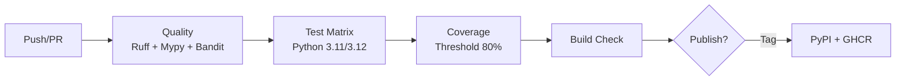

# 🧠 OpsMind v1.0.5

**Ansible-Driven Modernization Assessment Platform**

OpsMind is a legacy system modernization assessment platform that uses Ansible as its core discovery engine. It evaluates traditional enterprise systems for containerization readiness and generates actionable migration artifacts.

> "No more reinventing the wheel — combine industry-standard Ansible discovery with intelligent containerization assessment."

---

## ✨ Features

- 🔍 **Ansible-Powered Discovery** — Automatic system fact collection via SSH (or local)
- 📊 **Multi-Dimension Assessment** — Hardware, software, configuration, security scoring
- 📝 **Professional Reports** — Markdown, JSON, HTML with methodology transparency
- 🐳 **Artifact Generation** — Dockerfile, docker-compose, build scripts, migration plans
- 🔄 **Intelligent Fallback** — Auto-degrades from Ansible → Native → Mock
- 🎯 **Demo-Ready** — Built-in mock data for instant evaluation

---

## 🚀 Quick Start

### Installation

```bash
# Clone and install
git clone https://github.com/melonrind44345/opsmind.git
cd opsmind
pip install -e .

# Verify installation
opsmind --version
opsmind validate
```

### Quick Demo (No Dependencies Required)

```bash
# Discover a legacy CentOS 6 system (simulated)
opsmind discover legacy-centos --method mock

# Assess and generate report
opsmind assess --report-format markdown

# Generate migration artifacts
opsmind generate docker
opsmind generate migration-plan

# Or run the full pipeline in one command
opsmind pipeline legacy-centos --method mock --report-format html --remediation
```

### Real System Discovery

```bash
# Localhost discovery
opsmind discover localhost --method ansible

# Remote host discovery
opsmind discover 192.168.1.100 --method ansible --ssh-user ubuntu

# Full pipeline
opsmind pipeline localhost --report-format html
```

---

## 📋 Command Reference

| Command | Description |
|---------|-------------|
| `discover <target>` | Discover system information from target host(s) |
| `assess` | Assess discovery results for containerization readiness |
| `report show/export/compare` | View, export, or compare assessment reports |
| `generate docker` | Generate Docker configuration files |
| `generate migration-plan` | Generate migration plan documents |
| `validate` | Check system dependencies and configuration |
| `pipeline <target>` | Run complete discovery → assessment → reporting workflow |
| `demo` | Interactive 4-phase capability showcase |

### Options

- `--method` (`-m`): Discovery method — `ansible`, `native`, `mock`, `auto` (default)
- `--inventory` (`-i`): Custom Ansible inventory file
- `--ssh-user` (`-u`): SSH username for remote hosts
- `--ssh-key` (`-k`): SSH private key path
- `--report-format` (`-f`): Output format — `markdown` (default), `json`, `html`
- `--detail-level` (`-d`): Report detail level — `executive`, `summary`, `detailed`, `raw`
- `--remediation` (`-r`): Generate remediation artifacts after assessment
- `--optimize`: Artifact optimization target — `performance`, `size`, `cost`

---

## 🏗️ Architecture

```
Command → Discovery Engine → Assessment Evaluators → Report Generators → Artifact Generation
              │                       │                      │                    │
         ┌─────┴─────┐          ┌─────┴──────┐             ┌─┴──┐               ┌─┴────┐
         │ Ansible   │          │ Feasibility│             │ MD │               │Docker│
         │ Native    │          │ Complexity │             │JSON│               │Plan  │
         │ Mock      │          │ Security   │             │HTML│               │      │
         └───────────┘          └────────────┘             └────┘               └──────┘
```

### Discovery Engines

| Engine | Method | Requirement | Use Case |
|--------|--------|-------------|----------|
| **Ansible** | SSH setup module | `ansible` CLI installed | Primary — richest data |
| **Native** | Python psutil | `psutil` package | Local fallback |
| **Mock** | Simulated data | None | Demo & testing |

### Assessment Dimensions

| Dimension | Weight | What It Evaluates |
|-----------|--------|-------------------|
| Hardware Compatibility | 30% | CPU arch, cores, memory, disk |
| Software Support | 30% | OS version, kernel, packages |
| Configuration Complexity | 20% | Services, dependencies, storage |
| Security Baseline | 20% | Firewall, SELinux, updates |

---

## 📊 Example Output

```
╭─────────── Assessment Result ───────────╮
│ legacy-app-01                            │
│ Feasibility Score: 32.5/100              │
│ Complexity: COMPLEX                      │
│ Risk Level: HIGH                         │
│ Strategy: refactor                       │
│ Estimated Effort: 14 days                │
╰──────────────────────────────────────────╯
```

---

## 🔄 CI/CD Pipeline

[](https://github.com/melonrind44345/OpsMind/actions/workflows/ci.yml)
[](https://github.com/melonrind44345/OpsMind/actions/workflows/security.yml)

OpsMind uses **GitHub Actions** as its CI/CD platform.

### Pipeline Architecture



### Quick Start

```bash
# Run the full CI pipeline locally
./scripts/ci/local-test.sh

# Run a specific stage
./scripts/ci/local-test.sh --stage quality
./scripts/ci/local-test.sh --stage test

# Skip security scans for faster feedback
./scripts/ci/local-test.sh --skip-security

# Simulate GitHub Actions locally with act
act push --job quality
act pull_request
```

> See [CI/CD Guide](docs/CI.md) for full GitHub Actions setup, pipeline stage details, and troubleshooting.

---

## 🧪 Testing

```bash
# Run unit tests
pytest tests/unit/ -v

# Run integration tests
pytest tests/integration/ -v

# Run all tests with coverage
pytest --cov=opsmind tests/ -v

# Run performance benchmarks
pytest tests/ -m slow -v
```

---

## 📚 Documentation

- [User Guide](docs/USER_GUIDE.md) — Quick start, scenarios, troubleshooting
- [Architecture Guide](docs/ARCHITECTURE.md) — System design and module overview
- [Developer Guide](docs/DEVELOPER_GUIDE.md) — Contributing, code style, tooling
- [Discovery Methods](docs/DISCOVERY_METHODS.md) — Ansible, Native, Mock detailed guide
- [Ansible Integration](docs/ANSIBLE_INTEGRATION.md) — Ansible setup and configuration
- [CI/CD Design](docs/CICD_DESIGN.md) — Pipeline design and architecture
- [CI/CD Guide](docs/CI.md) — GitHub Actions setup, configuration, and troubleshooting

---

## 🎯 Project Roadmap

### v1.0.2 (Current) — Production Release
- ✅ Ansible-based system discovery with multi-engine fallback
- ✅ Multi-dimensional assessment engine (Hardware, Software, Config, Security)
- ✅ Professional report generation (Markdown/JSON/HTML)
- ✅ Docker artifact and migration plan generation
- ✅ Full CI/CD pipeline (Quality, Test Matrix, Coverage, Build, Release)
- ✅ Docker multi-stage production image with GHCR publishing
- ✅ Weekly security auditing (SAST, dependency scan, container scan)
- ✅ FastAPI web API server for K8s deployment
- ✅ Demo mode with mock data for instant evaluation

### v1.1.0 — Enhanced Capabilities
- Custom assessment rules engine
- Batch assessment and comparison
- PDF report export
- Ansible Tower/AWX integration

### v1.2.0 — Platform Features
- Real-time discovery monitoring dashboard
- Custom report templates
- Multi-cluster assessment
- Plugin architecture for custom engines

---

## 🤝 Contributing

1. Fork the repository
2. Create a feature branch (`git checkout -b feature/amazing`)
3. Commit changes (`git commit -m 'Add amazing feature'`)
4. Push to branch (`git push origin feature/amazing`)
5. Open a Pull Request

---

## 📄 License

MIT License — See [LICENSE](LICENSE) for details.

---

## 🙏 Acknowledgments

- **Ansible** community for the excellent automation framework
- **Typer** & **Rich** for the modern Python CLI experience
- **Pydantic** for the type-safe data validation

---

*Built with ❤️ for the DevOps community — helping transform legacy systems, one container at a time.*
