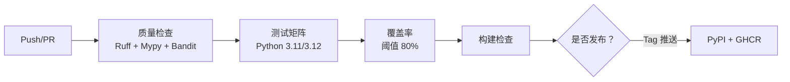

# 🧠 OpsMind v1.0.2

**基于 Ansible 的现代化改造评估平台**

OpsMind 是一个遗留系统现代化改造评估平台，以 Ansible 为核心发现引擎。它评估传统企业系统的容器化就绪程度，并生成可操作的迁移产物。

> "不再重复造轮子 —— 将业界标准的 Ansible 发现能力与智能容器化评估相结合。"

---

## ✨ 特性

- 🔍 **Ansible 驱动发现** — 通过 SSH（或本地）自动采集系统信息
- 📊 **多维度评估** — 硬件、软件、配置、安全等多维度评分
- 📝 **专业报告** — 支持 Markdown、JSON、HTML 格式，评估方法透明可追溯
- 🐳 **产物生成** — Dockerfile、docker-compose、构建脚本、迁移方案
- 🔄 **智能降级** — 自动降级策略：Ansible → Native → Mock
- 🎯 **开箱即用** — 内置模拟数据，无需依赖即可快速体验

---

## 🚀 快速开始

### 安装

```bash
# 克隆并安装
git clone https://github.com/melonrind44345/opsmind.git
cd opsmind
pip install -e .

# 验证安装
opsmind --version
opsmind validate
```

### 快速演示（无需任何依赖）

```bash
# 发现遗留 CentOS 6 系统（模拟数据）
opsmind discover legacy-centos --method mock

# 评估并生成报告
opsmind assess --report-format markdown

# 生成迁移产物
opsmind generate docker
opsmind generate migration-plan

# 或者一条命令跑通完整流水线
opsmind pipeline legacy-centos --method mock --report-format html --remediation
```

### 真实系统发现

```bash
# 发现本机
opsmind discover localhost --method ansible

# 发现远程主机
opsmind discover 192.168.1.100 --method ansible --ssh-user ubuntu

# 完整流水线
opsmind pipeline localhost --report-format html
```

---

## 📋 命令参考

| 命令 | 说明 |
|---------|-------------|
| `discover <目标>` | 从目标主机发现系统信息 |
| `assess` | 对发现结果进行容器化就绪评估 |
| `report show/export/compare` | 查看、导出或对比评估报告 |
| `generate docker` | 生成 Docker 配置文件 |
| `generate migration-plan` | 生成迁移方案文档 |
| `validate` | 检查系统依赖和配置 |
| `pipeline <目标>` | 运行完整的 发现 → 评估 → 报告 工作流 |
| `demo` | 交互式四阶段功能展示 |

### 选项

- `--method` (`-m`)：发现方式 — `ansible`、`native`、`mock`、`auto`（默认）
- `--inventory` (`-i`)：自定义 Ansible 清单文件
- `--ssh-user` (`-u`)：远程主机 SSH 用户名
- `--ssh-key` (`-k`)：SSH 私钥路径
- `--report-format` (`-f`)：输出格式 — `markdown`（默认）、`json`、`html`
- `--detail-level` (`-d`)：报告详细程度 — `executive`（高管摘要）、`summary`（摘要）、`detailed`（详细）、`raw`（原始数据）
- `--remediation` (`-r`)：评估后生成修复产物
- `--optimize`：产物优化目标 — `performance`（性能）、`size`（体积）、`cost`（成本）

---

## 🏗️ 架构

```
命令 → 发现引擎 → 评估器 → 报告生成器 → 产物生成
          │              │              │              │
     ┌─────┴─────┐  ┌─────┴──────┐  ┌───┴──┐     ┌───┴────┐
     │ Ansible   │  │ 可行性     │  │ MD   │     │ Docker │
     │ Native    │  │ 复杂度     │  │ JSON │     │ 迁移   │
     │ Mock      │  │ 安全性     │  │ HTML │     │ 方案   │
     └───────────┘  └────────────┘  └──────┘     └────────┘
```

### 发现引擎

| 引擎 | 方式 | 依赖要求 | 适用场景 |
|--------|--------|-------------|----------|
| **Ansible** | SSH setup 模块 | 需安装 `ansible` CLI | 主力引擎 — 数据最丰富 |
| **Native** | Python psutil | `psutil` 包 | 本地回退方案 |
| **Mock** | 模拟数据 | 无 | 演示与测试 |

### 评估维度

| 维度 | 权重 | 评估内容 |
|-----------|--------|-------------------|
| 硬件兼容性 | 30% | CPU 架构、核心数、内存、磁盘 |
| 软件支持度 | 30% | 操作系统版本、内核、软件包 |
| 配置复杂度 | 20% | 服务、依赖关系、存储 |
| 安全基线 | 20% | 防火墙、SELinux、系统更新 |

---

## 📊 输出示例

```
╭─────────── 评估结果 ───────────╮
│ legacy-app-01                     │
│ 可行性评分: 32.5/100              │
│ 复杂度: COMPLEX（复杂）           │
│ 风险等级: HIGH（高）              │
│ 策略: refactor（重构）            │
│ 预估工时: 14 天                   │
╰──────────────────────────────────╯
```

---

## 🔄 CI/CD 流水线

[](https://github.com/melonrind44345/OpsMind/actions/workflows/ci.yml)
[](https://github.com/melonrind44345/OpsMind/actions/workflows/security.yml)

OpsMind 使用 **GitHub Actions** 作为 CI/CD 平台。

### 流水线架构



### 快速上手

```bash
# 在本地运行完整 CI 流水线
./scripts/ci/local-test.sh

# 运行指定阶段
./scripts/ci/local-test.sh --stage quality
./scripts/ci/local-test.sh --stage test

# 跳过安全扫描以加快反馈速度
./scripts/ci/local-test.sh --skip-security

# 使用 act 在本地模拟 GitHub Actions
act push --job quality
act pull_request
```

> 详细内容请参阅 [CI/CD 指南](docs/CI.md)，包括完整的 GitHub Actions 配置、各阶段说明和常见问题排查。

---

## 🧪 测试

```bash
# 运行单元测试
pytest tests/unit/ -v

# 运行集成测试
pytest tests/integration/ -v

# 运行全部测试并生成覆盖率报告
pytest --cov=opsmind tests/ -v

# 运行性能基准测试
pytest tests/ -m slow -v
```

---

## 📚 文档

- [用户指南](docs/USER_GUIDE.md) — 快速入门、使用场景、常见问题
- [架构指南](docs/ARCHITECTURE.md) — 系统设计与模块概览
- [开发者指南](docs/DEVELOPER_GUIDE.md) — 贡献指南、代码规范、开发工具
- [发现方式详解](docs/DISCOVERY_METHODS.md) — Ansible、Native、Mock 三种方式详细说明
- [Ansible 集成](docs/ANSIBLE_INTEGRATION.md) — Ansible 安装与配置
- [CI/CD 设计](docs/CICD_DESIGN.md) — 流水线设计与架构
- [CI/CD 指南](docs/CI.md) — GitHub Actions 配置与故障排查

---

## 🎯 项目路线图

### v1.0.2（当前版本）— 正式发布
- ✅ 基于 Ansible 的系统发现，支持多引擎自动降级
- ✅ 多维度评估引擎（硬件、软件、配置、安全）
- ✅ 专业报告生成（Markdown / JSON / HTML）
- ✅ Docker 产物与迁移方案生成
- ✅ 完整 CI/CD 流水线（质量、测试矩阵、覆盖率、构建、发布）
- ✅ Docker 多阶段生产镜像，发布至 GHCR
- ✅ 每周安全审计（SAST、依赖扫描、容器扫描）
- ✅ FastAPI Web API 服务，支持 K8s 部署
- ✅ 演示模式，内置模拟数据，开箱即用

### v1.1.0 — 能力增强
- 自定义评估规则引擎
- 批量评估与对比
- PDF 报告导出
- Ansible Tower / AWX 集成

### v1.2.0 — 平台特性
- 实时发现监控面板
- 自定义报告模板
- 多集群评估
- 插件架构，支持自定义引擎

---

## 🤝 参与贡献

1. Fork 本仓库
2. 创建特性分支 (`git checkout -b feature/amazing`)
3. 提交更改 (`git commit -m '添加了很棒的功能'`)
4. 推送到分支 (`git push origin feature/amazing`)
5. 发起 Pull Request

---

## 📄 许可证

MIT License — 详见 [LICENSE](LICENSE)。

---

## 🙏 致谢

- **Ansible** 社区提供的卓越自动化框架
- **Typer** 与 **Rich** 带来的现代化 Python CLI 体验
- **Pydantic** 提供的类型安全数据校验

---

*以 ❤️ 献给 DevOps 社区 —— 帮助改造遗留系统，一次一个容器。*
